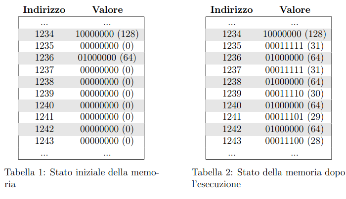
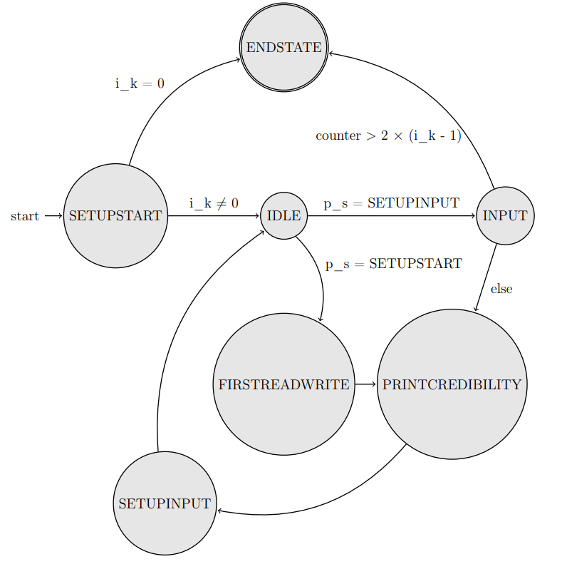
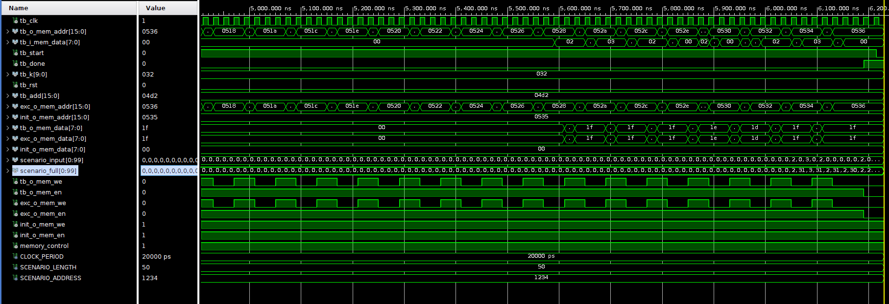
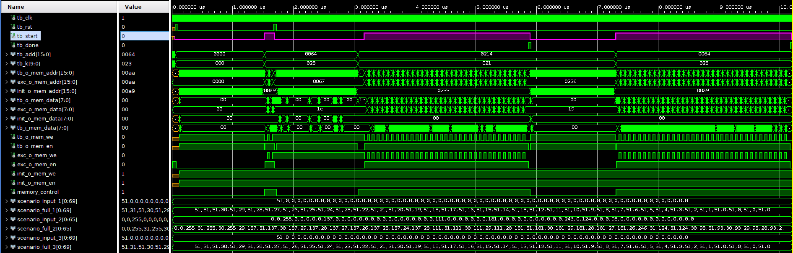
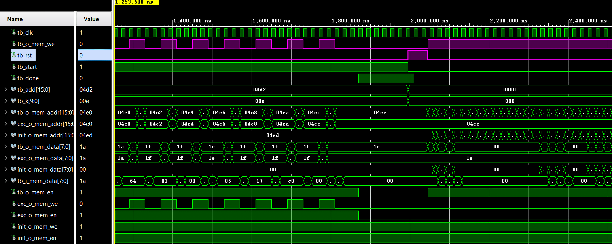
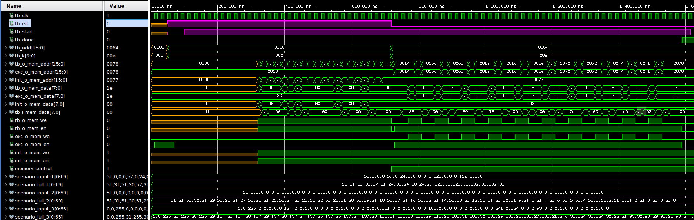

# Prova Finale di Reti Logiche - 2024
professore: Salice Fabio  

valutazione: 29/30
### Autori:
- [Grisoni Samuele](https://github.com/dedepivot)
- [Guarisco Alessio](https://github.com/Aleee-ggr)  

### Risorse:
- [Codice VHDL del modulo](vhdl_module.vhd)
- [Specifica](documentation/Specifica.pdf)
- [Relazione](documentation/Relazione.pdf)
- [Relazione (Latex)](documentation/Relazione_Latex)


Segue una versione della relazione autocompilata in markdown.  
Per una formattazione migliore si consiglia di guardare il pdf o la versione in Latex.


# Introduzione

## Obiettivo

L'obiettivo della seguente relazione è documentare l'architettura e lo
sviluppo di un elemento hardware descritto in VHDL per l'elaborazione di
una sequenza di numeri. Lo scopo finale è completare la sequenza in
maniera da ottenere una lista continua e discreta di valori. Il modulo
hardware dovrà quindi interfacciarsi con una memoria da cui leggere la
sequenza iniziale e scrivere al contempo la sequenza corretta. Nel
nostro caso, lo stream è composto da un valore decimale, seguito da un
valore di credibilità del numero appena letto. La credibilità
rappresenta l'accuratezza del valore appena letto ed è un numero da 31 a
0. Quando il valore numerico è nullo sarà necessario sostituire lo zero
in memoria con l'ultimo valore numerico noto. Il valore di credibilità
in questo caso verrà diminuito.

### Example

Segue un esempio dell'esecuzione del programma con la seguente stringa
di valori: **128, 64, 0, 0, 0**



## Idea di Base

Il processo è simile a quello utilizzato da alcuni algoritmi di
ricostruzione dati a partire da una serie incompleta di bit, oppure al
meccanismo di decompressione di un'immagine. Ad esempio, la nota
libreria di analisi dati di Python \"Panda\" offre un algoritmo di
interpolazione chiamato \"Forward Fill\" che, come nel nostro caso,
prende l'ultimo valore noto e lo propaga per riempire un dataset
incompleto. Algoritmi come il Run-Length Encoding comprimono le sequenze
ripetitive di dati. Questo significa che se dovesse avvenire la
decompressione dei dati, l'ultimo valore noto viene ripetuto per
riempire tutti i valori mancanti.

## Interfaccia del Progetto

``` {#lst:vhdl_example caption="interfaccia di progetto" label="lst:vhdl_example"}
entity project_reti_logiche is
    port (
            i_clk : in std_logic;
            i_rst : in std_logic;
            i_start : in std_logic;
            i_add : in std_logic_vector(15 downto 0);
            i_k   : in std_logic_vector(9 downto 0);
            
            o_done : out std_logic;
            
            o_mem_addr : out std_logic_vector(15 downto 0);
            i_mem_data : in  std_logic_vector(7 downto 0);
            o_mem_data : out std_logic_vector(7 downto 0);
            o_mem_we   : out std_logic;
            o_mem_en   : out std_logic
    );
end project_reti_logiche;
```

## Descrizione delle Porte {#PortDescription}

-   **i_clk:** clock in ingresso, generato dal Test Bench per
    sincronizzare il funzionamento della macchina.

-   **i_rst:** segnale asincrono di reset in ingresso, anch'esso
    generato dal Test Bench. Se 1 prepara il componente per ricevere il
    segnale di start.

-   **i_start:** Segnale di start in ingresso, generato dal Test Bench.
    Questo segnale avvia la sequenza di elaborazione.

-   **i_add:** vettore che rappresenta l'indirizzo di memoria da cui la
    sequenza da elaborare parte, generato dal Test Bench.

-   **i_k:** rappresenta la lunghezza della sequenza da elaborare,
    anch'esso generato dal Test Bench.

-   **o_done:** Segnale di uscita. Indica il completamento
    dell'elaborazione. Generato per comunicare al Test Bench che la
    sequenza è stata completamente processata.

-   **o_mem_address** Vettore di uscita che contiene l'indirizzo della
    memoria da cui leggere o scrivere i dati.

-   **i_mem_data:** Vettore di ingresso che trasporta i dati letti dalla
    memoria in corrispondenza dell'indirizzo fornito.

-   **o_mem_data:** Vettore di uscita che invia i dati da scrivere nella
    memoria all'indirizzo specificato.

-   **o_mem_en:** Segnale di uscita che funge da abilitazione per
    l'accesso alla memoria. Questo segnale deve essere alto (=1) per
    consentire l'operazione di lettura o scrittura.

-   **o_mem_we:** Segnale di uscita che indica se l'operazione in corso
    è una scrittura. Deve essere alto (=1) per scrivere nella memoria;
    altrimenti, l'operazione predefinita è la lettura.

# Architettura

## La macchina a stati finiti

<figure id="fig:fsm">
<p> <span
id="fig:DisallignmentScreen" label="fig:DisallignmentScreen"></span></p>
<figcaption><span id="fig:fsm" label="fig:fsm"></span>Schema della FSM
realizzata</figcaption>
</figure>

La figura [1]
rappresenta uno schema semplificato della FSM utilizzata per risolvere
il problema dato. La semplificazione, rispetto al codice fornito, è
stata effettuata per meri motivi grafici e riguarda nome e contenuto di
alcune variabili. Sono state inoltre rimosse alcune transizioni che,
seppur presenti nel codice, risulta impossibile che si verifichino. In
particolare nel nostro componente è presente una variabile
\"previous_state\" che tiene traccia dello stato visitato prima del nodo
IDLE. Tale variabile è stata trascritta come *p_s* all'interno dello
schema.\
È inoltre importante notare come *i_k* nello schema è stato
rappresentato come un segnale formato da un singolo bit, quando esso è
in realtà formato da un vettore di 10 bit.\
Lo stato di partenza della FSM è rappresentato dallo stato di
**SETUPSTART**, il quale si occupa di abilitare la memoria impostando
*o_mem_en = 1*, impostare la variabile di conteggio *counter = 0* e di
effettuare un controllo sul numero di parole da leggere, *i_k*. Se tale
segnale è uguale a zero imposta lo stato corrente a ENDSTATE in modo da
terminare l'esecuzione del componente al prossimo ciclo di clock. Nel
caso in cui il numero di parole sia diverso da zero, SETUPSTART imposta
la memoria in modalità di lettura mettendo *i_mem_we* a *0*, legge la
prima parola presente sull'indirizzo in ingresso *i_add* e imposta il
prossimo stato a IDLE.\
Lo stato di **IDLE** è introdotto, per compensare la lentezza di
risposta nella memoria in seguito a una richiesta di lettura. In
particolar modo se lo stato precedentemente visitato è SETUPSTART
imposta la variabile *current_state* a FIRSTREADWRITE; altrimenti, se lo
stato visitato in precedenza è SETUPINPUT, imposta tale variabile a
INPUT.\
Lo stato di **FIRSTREADWRITE** si occupa della lettura della prima
parola in input. Se tale parola è *0* presenta un edge-case, richiedendo
di impostare la credibilità a 0; altrimenti essa viene impostata a 31,
come da specifica. Lo stato si occupa inoltre di impostare la memoria in
modalità scrittura in modo da poter stampare la credibilità al prossimo
ciclo di clock.\
**PRINTCREDIBILITY** è lo stato che si occupa di stampare la credibilità
nella cella di memoria posta all'indirizzo ottenuto come *i_add +
contatore + 1*.\
Lo stato di **SETUPINPUT** imposta i corretti segnali per la lettura
della prossima parola dalla memoria. In particolare la memoria viene
messa in lettura, la variabile counter viene aumentata di 2, in modo da
poter leggere la parola successiva, e il nuovo indirizzo di memoria da
leggere, *o_mem_addr*, viene aggiornato con la somma di *i_add +
counter*.\
Lo stato di **INPUT** si occupa di verificare se sono state lette *i_k*
parole confrontando tale segnale con la variabile counter o, in
alternativa, di aggiornare la credibilità in base alla nuova parola
letta. Quando counter viene confrontato con *i_k* è necessario
moltiplicare tale segnale per 2 affinchè la disequazione risulti
corretta. Se tale espressione risulta verificata, la variabile
*current_state* viene impostata pari a ENDSTATE in modo da terminare il
processo al prossimo ciclo di clock. Se la disequazione non è vera, è
necessario leggere almeno un'altra parola e aggiornare la variabile
*credibility* di conseguenza. Se la parola letta risulta essere 0 allora
la credibilità viene scalata di 1, purchè sia positiva, come da
specifica; altrimenti viene impostata al valore 31. Viene impostata la
variabile *current_state* a PRINTCREDIBILITY in modo da poter scrivere
in memoria la credibilità al prossimo ciclo di clock.\
Lo stato di **ENDSTATE** disabilita la memoria impostando *o_mem_en* a 0
e segnala al TestBench di aver terminato il processo impostando il
segnale *o_done* a *1*.\

## Lettura e scrittura in un singolo ciclo {#SingleReading}

Il problema principale riscontrato durante lo sviluppo è stato la
lentezza della memoria presente nel TestBench. Tale componente infatti
introduce un ritardo di 1 ns che impedisce di scrivere la credibilità e
leggere la parola successiva in due cicli di clock successivi come
visibile nella figura [7].
Come scritto in precedenza sia lo stato SETUPINPUT che lo stato di
SETUPSTART hanno tra i vari loro compiti quello di impostare il corretto
valore ai segnali per predisporre la memoria per la lettura. La risposta
della TestBench a tale modifica non è però sicronizzata con la salita
del segnale di clock, a causa del ritardo sopracitato, e una eventuale
lettura eseguita nello stato immediatamente successivo a quest'ultimo
comporta l'acquisizione di un input uguale a 0 nel caso di lettura
immediatamente dopo SETUPSTART, o del valore della credibilty appena
scritto nel caso di lettura dopo PRINTCREDIBILIY.\
La soluzione a cui abbiamo pensato è stata quella di introdurre un
insieme di *SETUPSTATE* con il compito di fare da cuscinetto tra la
scrittura e la lettura, impiegando un ciclo di clock, permettendo alla
memoria di mostrare in uscita la parola corretta durante l'esecuzione di
tale stato. Ciò permette di poter leggere il dato corretto nel ciclo di
clock successivo. Tale soluzione è stata poi ottimizzata nello stato
IDLE con l'obbiettivo di diminuire il numero di stati ridondanti.

## Scelte implementative nello sviluppo della FSM

Per realizzare il componente sono state effettuate una serie di scelte
implementatitive; alcune sono visibili nello schema
[1] mentre altre
sono state omesse per semplicità grafica.\
Tra queste modifiche troviamo la scelta di gestire lo stato di IDLE con
uno switch-case, di fatto realizzando una piccola FSM dentro la nostra
macchina a stati. Quando si utilizza tale operatore, il linguaggio VHDL
richiede che ogni possibile valore che può essere assunto dalla
variabile presa in cosiderazione, sia gestito. Ciò ci ha costretti a
creare un branch \"others\" che fa terminare il programma nel caso in
cui *previous_state* abbia un valore diverso da SETUPINPUT o SETUPSTART.
L'aggiunta di \"others\" fa in modo di evitare l'insorgere di latch nel
nostro compoente, nonostante questa opzione non sia di fatto mai
eseguita nel nostro codice. Questa scelta crea una possibile transazione
tra IDLE e ENDSTATE ma tale collegamento, non essendo mai utilizzato,
non è stato rappresentato nello schema della FSM.\
Durante lo sviluppo si è preferito di rimanere in uno specifico stato
per un solo ciclo di clock. Questa scelta è stata fatta per separare, da
un punto di vista logico le operazioni effettuate dal nostro componente
sulla memoria. Questa scelta si è rivelata molto elegante per
rappresentare la FSM in quanto per determinati stati come INPUT,
PRINTCREDIBILITY e IDLE il solo nome è sufficente a far capire il loro
ruolo. Inoltre, poichè ogni stato effettua poche operazioni elementari,
il codice scritto per ognuno di essi risulta corto, facilmente
consultabile e modificabile.\
Questa scelta implementativa ha reso necessario aumentare il numero di
stati pur di non avere autoanelli e di conseguenza avere sequenze di
stati che, in teoria, potevano essere unite. Un esempio di tale sequenza
è formato da FIRSTREADWRITE-PRINTCREDIBILITY-SETUPINPUT. Si noti che
l'introduzione di questi stati non rallenta l'esecuzione del nostro
componente in quanto, come spiegato nella sezione
*[2.2]*,
sono comunque necessari 3 cicli di clock per completare una lettura e
scrittura.\
Un'ulteriore scelta implementativa, non rappresentata nel disegno della
FSM, riguarda lo stato finale. In ENDSTATE, poichè non viene più
aggiornata la variabile *current_state* ad ogni ciclo di clock, si ha un
autoanello che riporta continuamente la FSM in ENDSTATE.

## Altri errori riscontrati durante lo sviluppo della FSM

Durante la realizzazione della macchina a stati sopraindicata
([1]) sono stati
riscontrati una serie di problemi minori, tra i più significativi
troviamo:

-   **mem_en$\ne$ 0:** Nella prima iterazione della macchina, una volta
    raggiunto ENDSTATE, l'unica operazione effettuata era quella di
    impostare il segnale *o_done* a 1. Questo provocava un errore poichè
    la memoria era lasciata attiva, comportando un fallimento del test.
    La modifica, è stata quella di attribuire a ENDSTATE il compito di
    porre *o_mem_en = 0* prima di eseguire qualsiasi altra istruzione.

-   **Counter Overflow:** Durante l'esecuzione di TestBench con una
    grande quantità di parole, abbiamo incrontrato un overflow della
    variabile counter, utilizzata come offeset rispetto a *i_add* per
    calcolare le posizioni in cui scrivere la credibilty o leggere le
    nuove parole. Tale variabile era stata dimensionata a 10 bit come
    *i_k*, ovvero il segnale in ingresso che indica il numero di parole
    da leggere.\
    Tale dimensionamento è risultato errato poichè counter aumenta di 1
    per ogni parola da leggere e per ogni credibility da scrivere. Il
    risultato è quindi grande almeno il doppio rispetto al numero
    contenuto in *i_k*. Per risolvere questo problema è stato deciso di
    dimensionare counter a 16 bit, la dimensione di *i_add*.

# Risultati Sperimentali {#Risultati Sperimentali}

## Sintesi


L'immagine mostra il risultato della sintesi del nostro componente.
Poichè i segnali di ingresso e uscita del componente sono già stati
descritti nella apposita sezione
[1.4] qui verranno analizzati, in ordine, solo i
più rilevanti:

1.  **tb_clk:** Rappresenta il segnale di clock della TestBench.

2.  **exc_o_mem_addr:** Rappresenta l'indirizzo a cui si sta effetuando
    l'operazione di scrittura o lettura nella TestBench. I numeri
    scritti dentro al segnale rappresentano, in HEX, il valore
    dell'indirizzo. Per motivi grafici sono stati omessi gli indirizzi
    in cui è stata scritta la credibilità, i quali però sono successivi
    agli indirizzi di lettura.

3.  **tb_i_mem_data:** Rappresenta il valore che si sta leggendo
    dall'indirizzo *o_mem_add*. Già da questa immagine si può notare
    come esista un disallineamento tra l'aggiornamento del clock e
    dell'indirizzo di memoria rispetto all'aggiornamento del valore
    letto.

4.  **tb_start**: Rappresenta il segnale inviato dalla TestBench al
    nostro componente per avviare il processo. Si noti che questo
    segnale, come da specifica, rimane alto finchè il componente non
    dichiara di aver terminato il processo con alzando il segnale di
    *tb_done*.

5.  **tb_done:** Si alza a 1 solo quando il processo è terminato.

6.  **tb_k:** Rappresenta la quantità di parole da dover leggere in HEX.
    In questa TestBench: 000e (14 in decimale).

## Aggiornamento memoria in ritardo


In questa figura si evince chiaramente il problema indotto dal ritardo
della memoria. In particolare ricordiamo che: il primo segnale
rappresenta il clock, il secondo l'indirizzo della cella di memoria e il
terzo il valore letto o scritto in tale cella.\
Dal quarto ciclo di clock il componente si trova nello stato
PRINTCREDIBILITY. Si può osservare come la scritta del valore di
credibilità 1f (31 in decimale) avvenga dopo la salita del clock. Questo
ritardo, sommato al ritardo indotto dall'operazione di lettura,
impedisce di leggere il dato corretto contenuto nella cella 04d4
immediatamente dopo aver scritto nella cella 04d3. Effettuando la
lettura al quinto ciclo di clock infatti andremmo a leggere il valore
1f, ovvero la credibility, invece della nuova parola 40 (64 in
decimale).\
Per risolvere tale problema è necessaro ritardare l'operazione di
scrittura di un ciclo di clock e ciò avviene tramite lo stato IDLE.
L'operazione di lettura avviene in corrispondenza della linea verticale
gialla al sesto ciclo di clock.

## Edge Cases

### Estremi di K

I casi limite per il valore di K sono K = 0 e K = 1023.

In particolare se K è pari a 0 non ci sono parole da elaborare. Il
modulo gestisce correttamente questa condizione senza entrare in loop o
causare errori, e alzare immediatamente il segnale DONE.

Se K assume il valore massimo possibile (1023, dato che è un segnale a
10 bit) Il modulo deve gestire correttamente l'intero intervallo di
valori senza eccedere i limiti di memoria o causare overflow.

### Sequenza di Zero

<figure id="fig:DisallignmentScreen">
<p> <span
id="fig:DisallignmentScreen" label="fig:DisallignmentScreen"></span></p>
</figure>

Si rilevano due casi limite legati alle sequenze di zero.

Il primo è una serie di più di 62 zeri. Questo fa sì che la credibility
si azzeri ed è quindi possibile controllare che il modulo si comporti in
maniera corretta, non andando in underflow ma mantenendo il valore della
credibility a zero.

Il secondo caso è testato dalla testbench con una serie di numeri che
iniziano con zero. Il comportamento osservato è mantenere gli zero
all'interno della memoria, sia per la credibility sia per il valore
numerico.

Il modulo è stato fatto girare su una testbench che parte con una serie
di valori numerici e credibilità zero, così da escludere comportamenti
errati di entrambi i casi.

### Multipli Start

<figure id="fig:DisallignmentScreen">
<p> <span
id="fig:DisallignmentScreen" label="fig:DisallignmentScreen"></span></p>
</figure>

Dato che da specifica il modulo deve essere in grado di accettare un
segnale START anche dopo che una serie numerica è terminata una
testbench è stata utilizzata per testare la possibilità di avere più di
uno START in una sola testbench.

### Reset durante la lettura

<figure id="fig:DisallignmentScreen">
<p> <span
id="fig:DisallignmentScreen" label="fig:DisallignmentScreen"></span></p>
</figure>

È stato esaminato il comportamento del modulo in presenza di un segnale
di reset asincrono, attivato intenzionalmente durante una lettura dalla
memoria. Questo test è cruciale per valutare la robustezza e
l'affidabilità del modulo in situazioni in cui potrebbe verificarsi un
reset imprevisto, interrompendo le operazioni in corso. È stato inoltre
verificato che il modulo, dopo il reset, ritorna correttamente allo
stato iniziale predefinito e rimane pronto per un successivo segnale di
Start.

### Start durante il Reset

<figure id="fig:DisallignmentScreen">
<p> <span
id="fig:DisallignmentScreen" label="fig:DisallignmentScreen"></span></p>
</figure>

Un altro scenario critico testato è stato l'attivazione del segnale di
Start mentre il modulo era soggetto a un segnale di Reset. Questo test è
stato progettato per analizzare il comportamento del sistema in race
condition tra il tentativo di avvio di una nuova operazione e la
richiesta di ripristino allo stato iniziale.

In particolare, è stato monitorato come il modulo gestisce la priorità
tra questi due segnali, valutando se l'operazione di Start viene
ignorata, ritardata, o se può innescare un comportamento anomalo. È
stato inoltre verificato se il modulo, una volta completato il reset, è
in grado di riconoscere correttamente il segnale di Start e avviare
l'operazione desiderata senza errori.

# Conclusione

Il progetto ha raggiunto l'obiettivo prefissato di sviluppare un modulo
hardware in VHDL in grado di elaborare una sequenza di numeri,
correggendo i valori mancanti attraverso la propagazione dell'ultimo
valore noto.

La scelta di scrivere il modulo in Behavioural per simulare un algoritmo
informatico ci ha permesso di progettare in maniera funzionale una
scheda Hardware che può essere utilizzata nel campo delle scienze
informative.

Le scelte implementative adottate, come la suddivisione delle operazioni
in stati distinti all'interno della macchina a stati finiti, si sono
dimostrate efficaci nel gestire le complessità legate alla
sincronizzazione della memoria e all'ottimizzazione dei tempi di
esecuzione.

Nonostante si siano presentate alcune difficoltà iniziali, in
particolare nella gestione dei ritardi della memoria, il progetto è
stato completato con successo. Questo ha dimostrato la robustezza e
l'efficienza della soluzione proposta, evidenziando l'importanza di
un'attenta progettazione e implementazione nel contesto delle reti
logiche.
